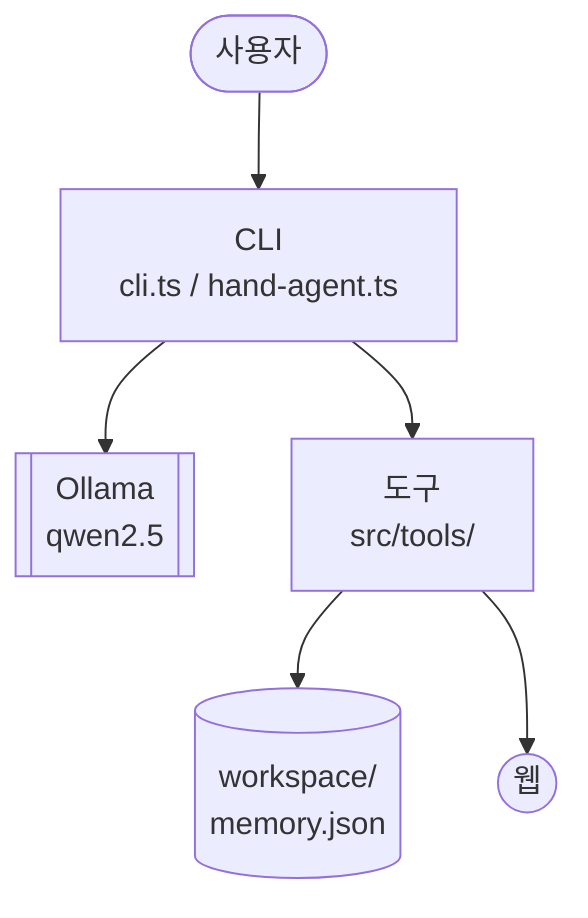
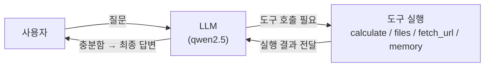
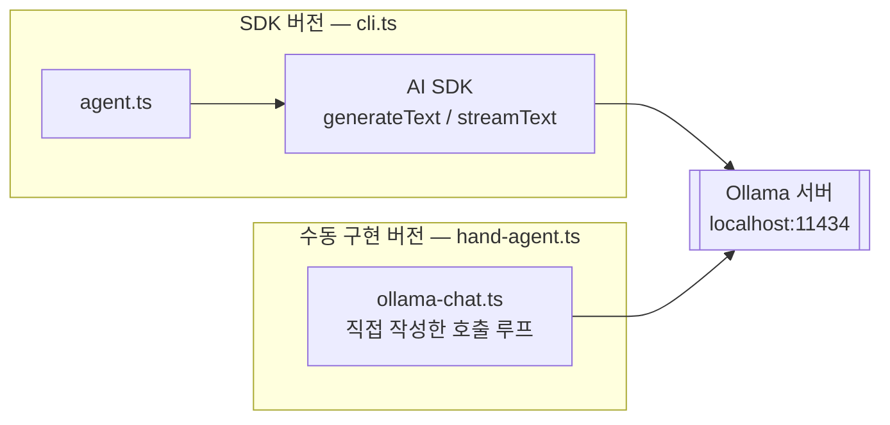

# mini-agent

도구를 호출해 파일을 읽고 쓰고, 웹 페이지를 가져오고, 사용자에 대한 사실을 기억하는
**LLM 에이전트를 처음부터 직접 만들어본 학습용 프로젝트**입니다.

"에이전트가 내부적으로 어떻게 동작하는가"를 이해하기 위해, 프레임워크 없이 손으로 작성한 버전과
[Vercel AI SDK](https://sdk.vercel.ai/)를 사용한 버전 두 가지를 나란히 구현했습니다. 두 버전을 비교하면
SDK가 대신 처리해주는 부분(도구 스키마 변환, 스텝 반복, 스트리밍 등)이 무엇인지 명확히 드러납니다.

로컬에서 [Ollama](https://ollama.com/)로 구동되는 `qwen2.5` 모델을 사용하므로, 별도 API 키 없이
CLI에서 바로 실행해볼 수 있습니다.

## 두 가지 구현

| | 파일 | 설명 |
|---|---|---|
| 수동 구현 | `src/hand-agent.ts`, `src/ollama-chat.ts` | Ollama Chat API를 직접 호출해서 "도구 호출 → 실행 → 결과를 다시 모델에 전달 → 반복" 루프를 손으로 구현 |
| SDK 기반 구현 | `src/agent.ts`, `src/cli.ts`, `src/provider.ts` | AI SDK의 `generateText`/`streamText`와 `tool()` 헬퍼를 사용한 구현 |

## 동작 구조

### 전체 구조



한눈에 보면: **사용자 입력을 CLI가 받아 → Ollama 모델에 전달하고, 모델이 필요로 하면 도구를 실행해
로컬 파일이나 웹에 접근**한 뒤 결과를 모델에 되돌려주는 구조입니다. 아래는 이 흐름을 더 자세히 뜯어본 것입니다.

### 에이전트 루프

에이전트 루프 자체는 단순합니다. 모델이 "도구가 필요하다"고 답하면 도구를 실행하고,
그 결과를 다시 모델에 보여준 뒤, 모델이 "이제 충분하다"고 판단할 때까지 반복하는 것뿐입니다.



이 루프를 두 가지 다른 방식으로 구현해서 비교했고, 모델 자체는 둘 다 로컬 Ollama 서버를 씁니다.



- **SDK 버전**: `@ai-sdk/openai-compatible`이 도구 스키마 변환, 스텝 반복, 스트리밍을 대신 처리
- **수동 구현 버전**: 위 과정을 `hand-agent.ts`에서 직접 for 루프와 JSON 파싱으로 구현
- `write_file`만 예외적으로 실행 전 사용자에게 y/n 확인을 받습니다 (`agent.ts`의 `confirmFn`)

## 주요 기능

- **도구 호출(Tool Calling)** (`src/tools/`)
  - `calculate` — 사칙연산 수식 계산 (직접 구현한 재귀 하강 파서, `+ - * / ()` 지원)
  - `read_file` / `write_file` / `list_files` / `search_files` — `workspace/` 폴더 내 파일 조작
  - `fetch_url` — 웹 페이지를 가져와 태그를 걷어내고 본문 텍스트만 추출
  - `remember` / `recall` — 사용자에 대한 사실을 `memory.json`에 저장하고 키워드로 검색 (장기 기억)
- **안전장치** — `write_file` 실행 전 사용자에게 y/n 확인을 받는 confirm 플로우 (`src/agent.ts`의 `confirmFn`)
- **대화 관리** — 응답 스트리밍 출력, 대화 히스토리 길이 제한(최근 20개로 트리밍)
- **에러 처리** — 모든 도구 실행을 공통 `wrap` 헬퍼로 감싸, 예외 발생 시 모델이 이해할 수 있는
  `"도구 오류: ..."` 문자열로 변환해 반환 (에이전트가 실패를 보고 스스로 재시도/대응 가능)

## 시작하기

### 사전 준비

- Node.js
- [Ollama](https://ollama.com/) 설치 후 모델 pull 및 서버 실행

```bash
ollama pull qwen2.5
ollama serve
```

### 설치 및 실행

```bash
npm install

# SDK 기반 CLI 실행
npm run cli

# 수동 구현 버전 실행 (인자로 질문 전달, 생략 시 기본 질문 사용)
npx tsx src/hand-agent.ts "17 곱하기 23은?"
```

`npm run cli` 실행 후 프롬프트에 자연어로 요청을 입력하면 됩니다. 종료하려면 `exit` 또는 빈 입력.

```
> workspace 폴더에 있는 파일 목록 보여줘
> notes.md 파일 내용 읽어줘
> 17 곱하기 23은?
> 내가 커피 좋아한다는거 기억해줘
> 내가 뭘 좋아한다고 했지?
```

## 프로젝트 구조

```
src/
├── agent.ts          # 시스템 프롬프트, confirm 훅 정의 (SDK 버전 공용 설정)
├── cli.ts             # SDK 기반 CLI 진입점 (streamText/generateText, 대화 루프)
├── provider.ts        # Ollama 모델 프로바이더 설정 (AI SDK의 openai-compatible)
├── hand-agent.ts      # Ollama Chat API를 직접 호출하는 수동 구현 버전
├── ollama-chat.ts     # 수동 구현용 Ollama Chat API 클라이언트
├── memory-store.ts    # remember/recall이 사용하는 JSON 파일 저장소
└── tools/
    ├── index.ts       # 도구 정의/등록, 공통 에러 wrap 처리 (SDK 버전이 사용)
    ├── calc.ts        # 수식 계산기
    ├── files.ts       # workspace 파일 읽기/쓰기/목록/검색
    ├── web.ts          # URL 가져오기 → 텍스트 추출
    └── memory.ts       # remember/recall을 tool()로 래핑

workspace/              # 에이전트가 실습 중 읽고 쓴 샘플 파일들
memory.json             # remember로 저장된 사실 목록 (실습 데이터)
```

## 향후 개선 방향

지금은 단일 에이전트가 정해진 도구를 순서대로 호출하는 수준이지만, 다음 방향으로 발전시켜볼 수 있습니다.

- **멀티 에이전트 협업**: 하나의 에이전트가 모든 도구를 처리하는 대신, 역할별 에이전트(예: 파일 담당 / 검색 담당 / 계산 담당)로 나누고 오케스트레이터가 작업을 분배·조율하는 구조로 확장
- **시맨틱 검색 결합**: `search_files`의 단순 키워드 매칭을 벡터 임베딩 기반 의미 검색(RAG)으로 교체해, 표현이 달라도 의도가 같은 내용을 찾아내도록 개선
- **더 큰 모델로 교체**: `qwen2.5`보다 파라미터가 크거나 도구 호출 성능이 검증된 모델로 바꿔가며, 모델 크기가 에이전트의 판단력·도구 선택 정확도에 미치는 영향을 비교

이런 확장을 직접 붙여보는 과정이 이 프로젝트의 다음 단계입니다. 에이전트의 내부 동작을 뜯어보는 데서 그치지 않고,
실제로 쓸모 있는 에이전트 시스템을 설계하고 조합할 수 있는 역량으로 이어가는 것이 최종 목표입니다.

## 참고

학습 목적의 프로젝트라 프로덕션 수준의 에러 처리, 테스트, 보안 검증은 포함되어 있지 않습니다.
